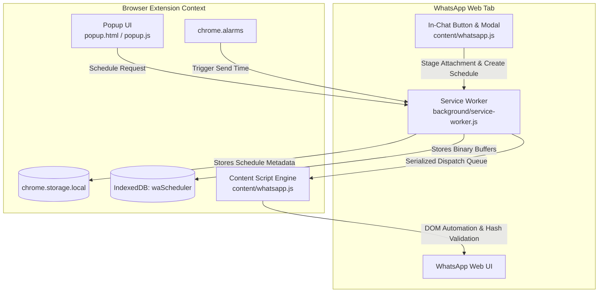

# WhatsApp Web Scheduler

<div align="center">


**A secure, local-first Manifest V3 Chrome Extension to schedule WhatsApp Web messages and attachments directly from the in-chat footer or extension popup with cryptographic file integrity verification.**

[](https://developer.chrome.com/docs/extensions/mv3/intro/)
[](manifest.json)
[](#-privacy--security)
[](LICENSE)

</div>

---

## 📌 Overview

**WhatsApp Web Scheduler** is a lightweight, privacy-focused browser extension designed for Google Chrome, Brave, and Chromium-based browsers. It allows you to schedule messages, documents, spreadsheets, images, and videos directly through WhatsApp Web without relying on third-party servers, external APIs, or exposing your personal WhatsApp credentials.

Everything runs entirely on your local machine using Chrome's native background service worker, IndexedDB, and `chrome.alarms` scheduler.

---

## ✨ Key Features

- 🕒 **Native In-Chat Scheduling Button**:
  - A sleek clock icon integrated directly into the WhatsApp Web chat footer (next to the mic/PTT button).
  - Opens a dark-themed, glassmorphic scheduling modal right inside your active conversation.
  - Auto-imports text drafts from your active chat composer.
  - Quick time preset chips (`+15 min`, `+1 hr`, `+3 hrs`, `Tomorrow 9 AM`, `Tomorrow 6 PM`).
  - Real-time attachment upload progress bar with instant confirmation toasts.
- 🔒 **100% Local & Private**: No cloud backends, no telemetry, no tracking. Your contacts, messages, and files never leave your browser sandbox.
- ⏰ **Reliable Background Scheduling**: Leverages `chrome.alarms` and persistent state in `chrome.storage.local` to trigger actions reliably across service worker lifecycles.
- 📎 **Exact Attachment Preservation**:
  - Full binary preservation stored in IndexedDB.
  - Cryptographic **SHA-256 hash validation** ensures the file sent is byte-for-byte identical to the original file selected.
  - Chunked streaming pipeline for large files without memory exhaustion.
- 🛡️ **UI Isolation & Guardian**: Extension UI elements (`#wa-sched-modal-root`, `#wa-sched-inchat-btn`, file pickers) are fully isolated, preventing automated send workflows from colliding with extension DOM.
- 🎯 **Intelligent Contact Selection (Extension Popup)**:
  - Auto-detects currently open WhatsApp Web chats.
  - Real-time contact filtering from your active chat list.
  - Direct search dispatch to WhatsApp Web for unlisted contacts and groups.
- 🔄 **Autonomous Error Recovery & Retries**:
  - Serialized FIFO dispatch queue per WhatsApp tab prevents message collisions.
  - Automatic retry mechanism with exponential backoff for temporary connection delays.
- 📊 **Diagnostics Dashboard**: Built-in diagnostics view (`options/options.html`) to inspect scheduled jobs, retry counters, execution states, and diagnostic event logs.

---

## 🏗️ Architecture



---

## 🚀 Installation

1. **Clone or Download the Repository**:
   ```bash
   git clone https://github.com/PannagaJA/Whatsapp-Scheduler.git
   ```
2. **Open Extensions Page in Chrome**:
   - Navigate to `chrome://extensions/` in your browser address bar.
3. **Enable Developer Mode**:
   - Toggle the **Developer mode** switch in the top-right corner.
4. **Load the Extension**:
   - Click **Load unpacked** in the top-left corner.
   - Select the `Whatsapp-Scheduler` folder containing `manifest.json`.
5. **Pin the Extension**:
   - Click the Extensions puzzle piece icon in your browser toolbar and pin **WhatsApp Scheduler** for quick access.

---

## 📖 Usage Guide

### Method 1: Scheduling Directly Inside WhatsApp Web (Recommended)
1. Open [WhatsApp Web](https://web.whatsapp.com/) and open any chat.
2. Click the **Clock** button in the bottom chat footer (next to the voice message icon).
3. Type your scheduled message or attach files (CSVs, PDFs, images, etc.).
4. Select the scheduled Date and Time or click a preset chip (e.g. `+15 min`, `Tomorrow 9 AM`).
5. Click **Schedule Message**. A confirmation toast will appear.

### Method 2: Scheduling via the Extension Popup
1. Click the **WhatsApp Scheduler** icon in your browser toolbar.
2. Choose your recipient:
   - Click **Use current** to automatically target the active chat tab.
   - Or pick a contact from the dropdown list.
   - Or type a contact/group name in the search field.
3. Enter your message text and attach any files.
4. Set the **Date** and **Time**, then click **Schedule message**.

---

## 📁 Project Structure

```
Whatsapp-Scheduler/
├── assets/                  # Extension icons and visual assets
│   ├── icon16.png
│   ├── icon32.png
│   ├── icon48.png
│   ├── icon128.png
│   └── logo.svg
├── background/              # Background execution engine
│   └── service-worker.js    # Chrome MV3 Service Worker (alarms, queue, IndexedDB staging)
├── content/                 # WhatsApp Web DOM automation & in-chat modal
│   └── whatsapp.js          # In-chat button, modal UI, debounced observer & automated sender
├── popup/                   # Extension popup interface
│   ├── popup.html
│   ├── popup.css
│   └── popup.js
├── options/                 # Extension configuration and diagnostics
│   ├── options.html
│   ├── options.css
│   └── options.js
├── backups/                 # Versioned snapshots & backups
├── manifest.json            # Extension configuration (Manifest V3)
├── .gitignore               # Git ignored patterns
└── README.md                # Project documentation
```

---

## 🛡️ Attachment & Media Preservation

| Attachment Type | Handling Strategy | Integrity Guarantee |
| :--- | :--- | :--- |
| **Documents / Data Files** (.csv, .pdf, .zip, .docx, etc.) | Raw binary streaming | Full SHA-256 byte-for-byte preservation |
| **Media Attachments** (.png, .jpg, .mp4, etc.) | WhatsApp Media Composer / File Picker | Extension verifies original binary before handover; server-side compression by WhatsApp may apply depending on upload mode |

> [!NOTE]
> For byte-for-byte exact preservation of images and videos without WhatsApp's automatic compression, attach them as documents.

---

## ⚙️ Operating Considerations

- **Browser Running**: The browser must be open and the computer active (not suspended/sleeping) at the scheduled send time for the alarm to trigger.
- **WhatsApp Web Logged In**: An active, authenticated session on `web.whatsapp.com` must exist.
- **Tab Persistence**: Keep at least one WhatsApp Web tab open in the browser.

---

## 🔒 Privacy & Security

- **Zero External Calls**: This extension makes no outbound network requests other than standard Chrome extension messaging within your own browser tabs.
- **No Third-Party Analytics**: No telemetry, tracking pixels, or remote SDKs are embedded.
- **Sandboxed Local Storage**: Data stays strictly within your browser's private extension sandbox (`chrome.storage.local` and `IndexedDB`).

---

## 📄 License

Distributed under the MIT License. See `LICENSE` for more information.
