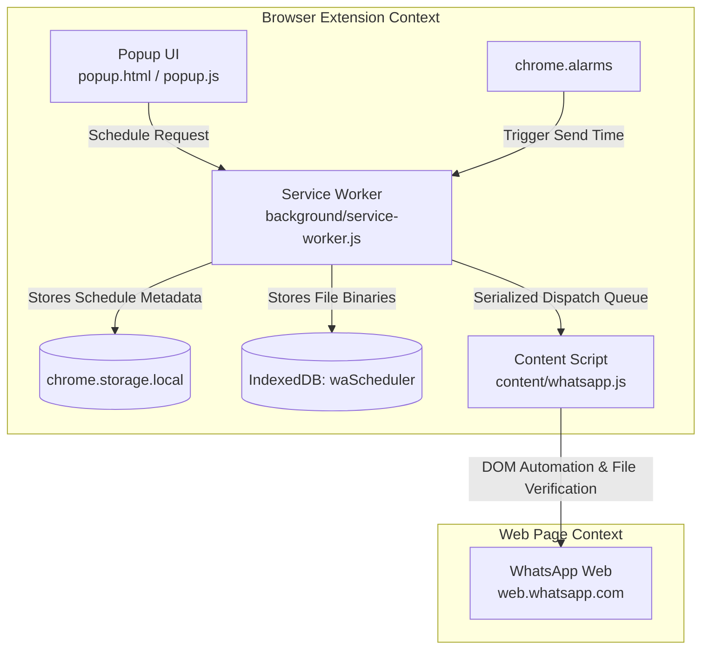

# WhatsApp Web Scheduler

<div align="center">


**A secure, local-first Manifest V3 Chrome Extension to schedule WhatsApp Web messages and attachments with cryptographic file integrity verification.**

[](https://developer.chrome.com/docs/extensions/mv3/intro/)
[](manifest.json)
[](#privacy--security)
[](LICENSE)

</div>

---

## 📌 Overview

**WhatsApp Web Scheduler** is a lightweight, privacy-focused browser extension designed for Google Chrome, Brave, and Chromium-based browsers. It allows you to schedule messages, documents, images, and videos directly through WhatsApp Web without relying on third-party servers, external APIs, or exposing your personal WhatsApp credentials.

Everything runs entirely on your local machine using Chrome's native background service worker, IndexedDB, and `chrome.alarms` scheduler.

---

## ✨ Features

- 🔒 **100% Local & Private**: No cloud backends, no telemetry, no tracking. Your contacts, messages, and files never leave your browser environment.
- ⏰ **Reliable Background Scheduling**: Leverages `chrome.alarms` and persistent state in `chrome.storage.local` to trigger actions reliably across service worker lifecycles.
- 📎 **Exact Attachment Preservation**:
  - Full binary preservation stored in IndexedDB.
  - Cryptographic **SHA-256 hash validation** ensures the file sent is byte-for-byte identical to the original file selected.
  - Chunked streaming pipeline for large files without memory exhaustion.
- 🎯 **Intelligent Contact Selection**:
  - Auto-detects currently open WhatsApp Web chats.
  - Real-time contact filtering from your active chat list.
  - Direct search dispatch to WhatsApp Web for unlisted contacts and groups.
- 🔄 **Autonomous Error Recovery & Retries**:
  - Serialized FIFO dispatch queue per WhatsApp tab prevents message collisions.
  - Automatic retry mechanism (retries every minute, up to 10 attempts) for temporary connection delays or busy composers.
- 📊 **Diagnostics Dashboard**: Built-in diagnostics view (`debug.html`) to inspect scheduled jobs, retry counters, execution states, and diagnostic event logs.

---

## 🏗️ Architecture



---

## 🚀 Installation

Since this is an unpacked developer extension, you can install it in just a few steps:

1. **Clone or Download the Repository**:
   ```bash
   git clone https://github.com/PannagaJA/Whatsapp-Scheduler.git
   ```
2. **Open Extensions Page in Chrome**:
   - Navigate to `chrome://extensions/` in your browser address bar.
3. **Enable Developer Mode**:
   - Toggle the **Developer mode** switch in the top-right corner.
4. **Load the Extension**:
   - Click **Load unpacked** in the top-left corner.
   - Select the folder containing `manifest.json`.
5. **Pin the Extension**:
   - Click the Extensions puzzle piece icon in your browser toolbar and pin **WhatsApp Scheduler** for quick access.

---

## 📖 Usage Guide

### 1. Initial Setup
1. Open [WhatsApp Web](https://web.whatsapp.com/) in a browser tab and log in.
2. Keep the WhatsApp Web tab open in the background.

### 2. Scheduling a Message
1. Click the **WhatsApp Scheduler** icon in your browser toolbar.
2. Choose your recipient:
   - Click **Use current** to automatically target the active chat tab.
   - Or pick a contact from the dropdown list.
   - Or type a contact/group name in the text field.
3. Enter your message text (optional if sending attachments).
4. Select any attachment files (images, PDFs, documents, audio, or video).
5. Choose the **Date** and **Time** for scheduled delivery.
6. Click **Schedule message**.

### 3. Managing Scheduled Messages
- View all pending, active, and completed messages directly in the popup interface.
- Open **Diagnostics** (`debug.html`) to view queue states, execution logs, and granular status updates.
- Remove or cancel scheduled jobs at any time before dispatch.

---

## 📁 Project Structure

```
Whatsapp-Scheduler/
├── assets/                  # Extension icons and visual assets
│   ├── icon16.png
│   ├── icon48.png
│   ├── icon128.png
│   └── logo.svg
├── background/              # Background execution engine
│   └── service-worker.js    # Chrome MV3 Service Worker (alarms, queue, IndexedDB)
├── content/                 # WhatsApp Web DOM automation
│   └── whatsapp.js          # Content script interacting with WhatsApp Web UI
├── popup/                   # Extension popup interface
│   ├── popup.html
│   ├── popup.css
│   └── popup.js
├── options/                 # Extension configuration page
│   └── options.html
├── debug.html               # Live diagnostics & inspection dashboard
├── debug.js                 # Diagnostics log reader and controller
├── manifest.json            # Extension configuration (Manifest V3)
├── .gitignore               # Git ignored patterns
└── README.md                # Project documentation
```

---

## 🛡️ Attachment & Media Preservation

| Attachment Type | Handling Strategy | Integrity Guarantee |
| :--- | :--- | :--- |
| **Documents / Files** (.pdf, .zip, .docx, etc.) | Raw binary streaming | Full SHA-256 byte-for-byte preservation |
| **Media Attachments** (.png, .jpg, .mp4, etc.) | WhatsApp Media Composer / File Picker | Extension verifies original binary before handover; server-side compression by WhatsApp may apply depending on upload mode |

> [!NOTE]
> For byte-for-byte exact preservation of images and videos without WhatsApp's automatic server-side compression, send them as documents rather than media files.

---

## ⚙️ Prerequisites & Operating Considerations

- **Browser Running**: The browser must be open and the computer active (not suspended/sleeping) at the scheduled send time for the alarm to trigger.
- **WhatsApp Web Logged In**: An active, authenticated session on `web.whatsapp.com` must exist.
- **UI Updates**: WhatsApp Web periodically updates its DOM structure. If changes occur, selectors in [`content/whatsapp.js`](content/whatsapp.js) are designed with fallback selector trees to maximize resilience.

---

## 🔒 Privacy & Security

- **Zero External Calls**: This extension makes no outbound network requests other than standard Chrome extension messaging within your own browser tabs.
- **No Third-Party Analytics**: No telemetry, tracking pixels, or remote SDKs are embedded.
- **Encrypted Local Storage**: Data stays strictly within your browser's private extension sandbox (`chrome.storage.local` and `IndexedDB`).

---

## 🤝 Contributing

Contributions, bug reports, and feature requests are welcome!

1. Fork the project
2. Create your feature branch (`git checkout -b feature/amazing-feature`)
3. Commit your changes (`git commit -m 'Add some amazing feature'`)
4. Push to the branch (`git push origin feature/amazing-feature`)
5. Open a Pull Request

---

## 📄 License

Distributed under the MIT License. See `LICENSE` for more information.
